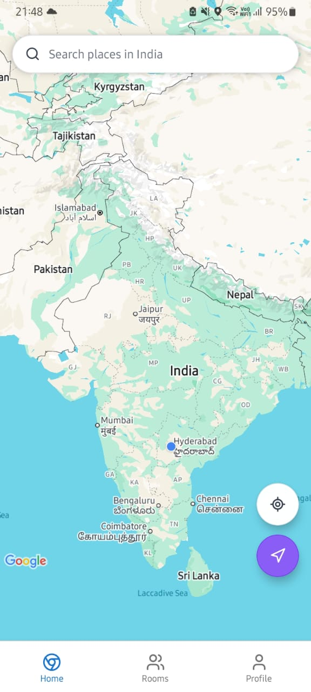
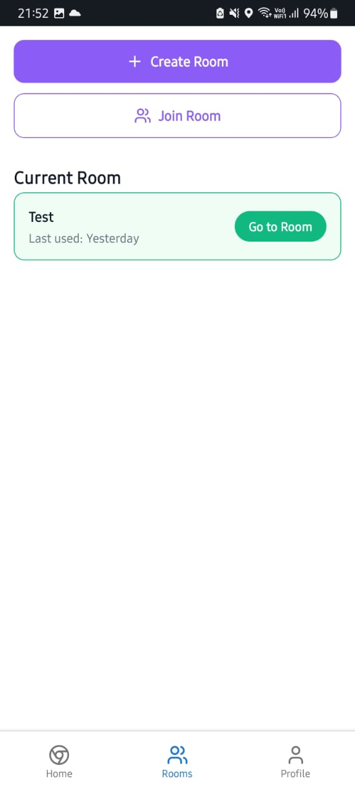
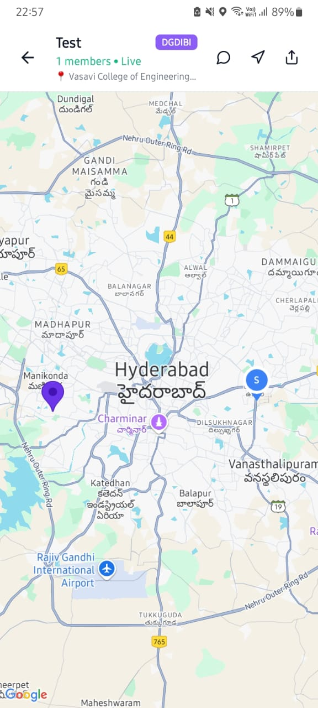
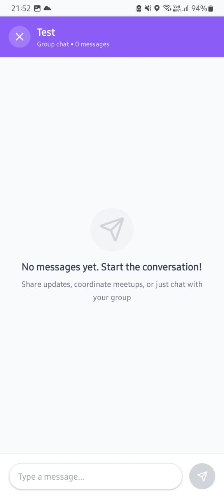
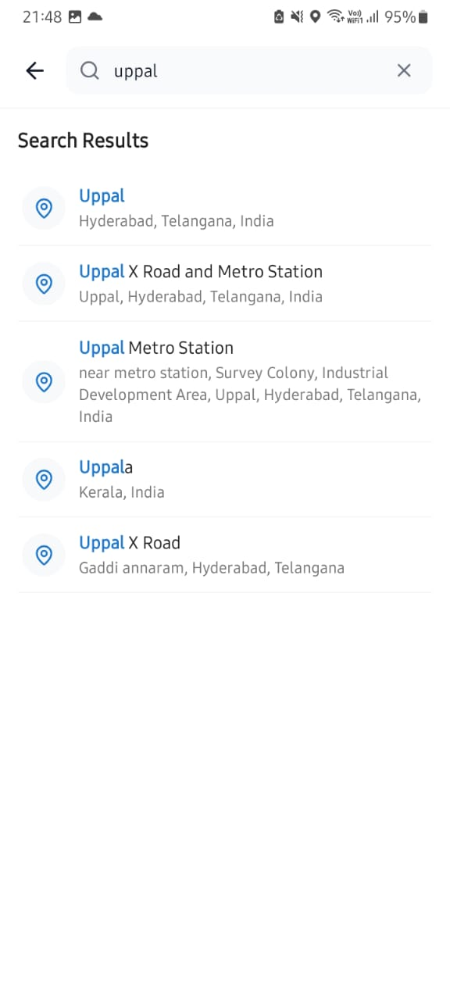
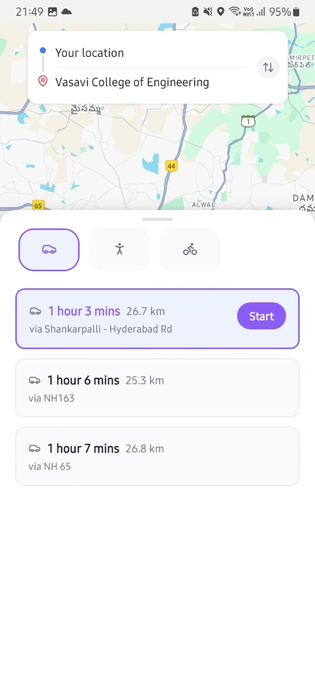
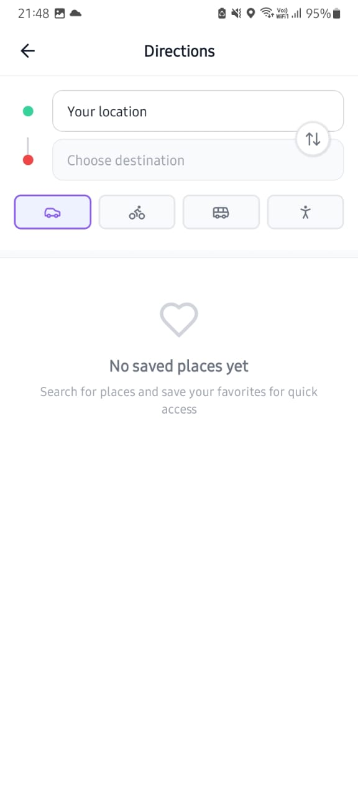

# WeMaps Frontend

WeMaps is a modern group navigation and communication app, designed to help people coordinate, share live locations, and travel together to a common destination. This repository contains the frontend code and documentation for the WeMaps mobile application.

---

## Table of Contents

- [Overview](#overview)
- [Features](#features)
- [Technologies Used](#technologies-used)
- [Key Differentiators](#key-differentiators)
- [How WeMaps Is Unique](#how-wemaps-is-unique)
- [Image Gallery](#image-gallery)
- [Backend](#backend)
- [Future Enhancements](#future-enhancements)
- [Contact](#contact)

---

## Overview

WeMaps is a next-generation extension of Google Maps, designed for groups who want to coordinate, communicate, and travel together. Unlike traditional navigation apps, WeMaps introduces private rooms where users can share live locations, chat in real time, and navigate to a common destination as a team. With the new route selection and navigation flow, users can seamlessly transition between the home tab and room tab: select a route to the room destination, navigate turn-by-turn, and view friends' live locations in the room tab. Contextual group chat, movement-optimized live tracking, and privacy-focused sign-in (no phone number required) streamline group travel for friends, families, event organizers, and more—all within a seamless, cross-platform mobile experience.

---

## Features

- **User Authentication:** Name+password based sign-in and sign-up with secure password hashing.
- **Location Services:** Interactive map, place search, and favorite locations.
- **Directions & Navigation:** Turn-by-turn directions, multiple travel modes, and voice guidance.
- **Seamless Route Selection:** In room-map, users can select a route to the room destination, then navigate with turn-by-turn instructions.
- **Tab Transitions:** Effortlessly switch between home and room tabs to navigate and view group locations.
- **Real-time Group Rooms:** Create/join rooms, share and view live locations of friends, and chat in-app.
- **Room Management:** View/manage current and recent rooms.
- **Persistent Data:** Saved places and recent searches stored locally.
- **Cross-Platform:** Consistent UI and experience on Android and iOS.

---

## Technologies Used

- **React Native**: Native mobile app development using JavaScript.
- **Expo**: Universal React framework for development and deployment.
- **Expo Router**: File-based routing and navigation.
- **React Native Maps**: Interactive map displays and markers.
- **Zustand**: State management.
- **Lucide React Native**: Vector icons.
- **@gorhom/bottom-sheet**: Customizable bottom sheets.
- **AsyncStorage**: Client-side persistent data storage.

---

## Key Differentiators

- **Group Navigation:** Built-in navigation for groups, not just individuals, with route selection and navigation to shared destinations.
- **Real-time Group Chat:** Contextual chat integrated with navigation in a room.
- **Live Location Tracking:** Optimized for dynamic group movement; view friends' locations while navigating.
- **Seamless Tab Transitions:** Smart navigation system that preserves user context when switching between tabs. Navigate routes in the home tab, then seamlessly switch to room tab to view group locations and chat - the app remembers your last active screen (room map or room index) and returns you there, creating a fluid workflow between solo navigation and group coordination.
- **Privacy:** No phone number required; sign in with name+password or Google authentication.
- **Dedicated Group Rooms:** Private rooms for focused coordination.
- **Integrated Experience:** Navigation and group communication in one app.

---

## How WeMaps Is Unique

WeMaps stands out from other popular apps by combining navigation, communication, and privacy in a single platform:

| Feature | WeMaps | Google Maps | WhatsApp/Snapchat |
|---------|------------|-------------|-------------------|
| **Group Navigation** | ✅ Built-in | ❌ Individual only | ❌ No navigation |
| **Real-time Group Chat** | ✅ Contextual | ❌ No chat | ✅ General chat |
| **Live Location Tracking** | ✅ Movement-optimized | ✅ Individual only | ✅ Static/basic |
| **Privacy (No Phone Required)** | ✅ Name+password/Google sign-in | ✅ No account needed | ❌ Phone required |
| **Dedicated Group Rooms** | ✅ Private rooms | ❌ No rooms | ✅ Group chats |
| **Navigation + Communication** | ✅ Integrated | ❌ Separate apps needed | ❌ No navigation |

WeMaps is designed for groups who want to meet, travel, and communicate together—making it easier to coordinate, share live locations, and reach a common destination, all in one app.

---

## Image Gallery

Showcase of WeMaps’s user interface and features:

<table>
  <tr>
    <td align="center">
       
      <b>Home Tab / Landing Screen</b> 
      Map, search bar, and directions shortcut
    </td>
    <td align="center">
       
      <b>Room Index Screen</b> 
      List of rooms, highlighting active one
    </td>
    <td align="center">
       
      <b>Active Room</b> 
      Live locations and group info
    </td>
  </tr>
  <tr>
    <td align="center">
       
      <b>Chat in Room</b> 
      In-room chat interface
    </td>
    <td align="center">
       
      <b>Search Places</b> 
      Search feature for places
    </td>
    <td align="center">
       
      <b>Route Selection</b> 
      Choose route to destination
    </td>
  </tr>
  <tr>
    <td align="center" colspan="3">
       
      <b>Directions Screen</b> 
      From/to selection like Google Maps
    </td>
  </tr>
</table>

 

---

## Backend

WeMaps frontend works with a dedicated backend for real-time data and room management. The backend code is not publicly available.

---

## Future Enhancements

WeMaps is designed for ongoing growth and innovation. Planned and potential future enhancements include:

- **Route Sharing and Broadcasting:** Allow users to share specific routes or broadcast their current route to the group, so followers can take the same optimal path.
- **Sharing Place Details in Chats:** Seamlessly share points of interest or destinations directly within the group chat, making it easy to suggest alternative stops or meeting points.
- **Privacy Toggles:** Granular control over location sharing and visibility within rooms, allowing users to customize what information they share and when.
- **Theme Modes:** Customization options for the app's visual appearance, including dark mode, high contrast, and personalized color schemes.
- **Advanced Room Features:**
  - Room Templates: Pre-configured room settings for common scenarios
  - Time-based Rooms: Automatically expire rooms after events
  - Role-based Permissions: Different access levels for room creators and members
  - Integration APIs: Connect with calendar and third-party services
- **Push Notifications:** Real-time alerts for room activity, navigation updates, and chat messages.
- **Multi-Device Sync:** Seamless experience across multiple devices for the same user.
- **Voice and Video Chat:** Enhanced communication options for group coordination.
- **Offline Mode:** Basic navigation and messaging features available even with limited connectivity.
- **Event Integration:** Sync with calendar events to create rooms and destinations automatically.
- **Analytics Dashboard:** Insights for users and organizers about group movement, arrival times, and coordination efficiency.

---

## Contact

For questions, suggestions, or to get in touch directly:

- **Email:** esanni04@gmail.com
